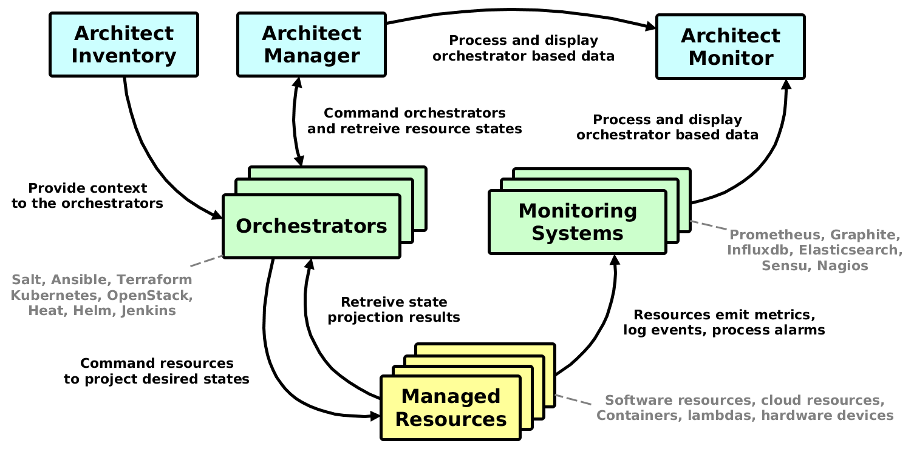

============================================================
The Architect Project |PypiVersion| |ReadTheDocs| |TravisCI|
============================================================

The aim of this project is to provide unified service modeling, management and
visualization platform agnostic of delivery method. It creates virtual
representations of any software services or physical resources and allows
control over their entire life-cycle. The name of project comes from Architect
program in Matrix movie series:

    In the Matrix the Architect is a highly specialized, humorless program of
    the machine world as well as the creator of the Matrix. As the chief
    administrator of the system, he is possibly a collective manifestation, or
    at the very least a virtual representation of the entire Machine
    mainframe.

The The Architect project was started as part of my thesis "Visualization of
cloud performace metrics". Following figure shows high-level achitecture of
Architect system.

You can find installation instructions, getting started guides, and API
documentation at https://architect-api.readthedocs.io/.

Architect Components
====================

The Architect project consists of 4 core compontents (inventory, manager,
monitor and document). A quick summary of properties, capabilities and
integrations for each component.

Inventory Component
-------------------

Inventory is the Architect's metadata engine. It encapsulates and unifies data
from various metadata sources to provide inventory metadata for various
orchestration services. Basically serves as metadata proxy with clients. It
works best integrated with http://salt-formulas.readthedocs.io/.

Currently supported metadata backends are:

* `salt-formulas <http://architect-api.readthedocs.io/en/latest/text/inventory-backends.html#salt-formulas-inventory>`_
* `reclass <http://architect-api.readthedocs.io/en/latest/text/inventory-backends.html#reclass-inventory>`_ (python3 version)

The currently supported customers of metadata provided by Inventory using
``architect-api`` client library are:

* SaltStack
* Ansible
* Puppet
* Chef

Following orchestrators have direct support for injecting context metadata:

* Heat

Manager Component
-----------------

Manager is the Architect's orchestration engine. The aim of this module is to
enforce infrastructure topologies models and acquire live infrastructure
topology data from any resource provider for further relational and
quantitative analysis and visualisations.

The pull approach for querying endpoint APIs is supported at the moment, the
processing push from target services is supported for SaltStack events.

Currently supported resource providers are:

* Kubernetes clusters
* OpenStack clouds
* Heat templates
* Amazon web services
* SaltStack infrastructures
* Terraform templates
* Jenkins pipelines

Monitor Component
-----------------

Monitor is the Architect's monitoring engine. It can connect to multiple
data endpoints and subject them for further analysis. We can define
queries for quantitative data or time-series in Document component.

Currently supported monitoring services are:

* Graphite
* ElasticSearch
* Prometheus
* InfluxDB

Document Component
------------------

Document component is responsible for analysis and visualization of
infrastructure resources in form of directed graph. We can perform several
transformation functions on this graph data. The other part is analysis of
quantitative data provided by monitoring solutions and corellating it to the
relational structures provided by Manager component.

Currently supported relational visualization layouts:

* Adjacency matrix
* Arc diagram
* Force-directed graph
* Hierarchical edge bundling
* Hive plot
* Circle packing
* Node-link tree (Reingold-Tilford tidy trees, dendrograms)
* Partition layout (sunburst, icicle diagrams, treemaps)
* Sankey diagram

Currently supported quatitative visualization layouts:

* Line chart
* Bar chart, stacked bar chart
* Horizon chart
* Donut chart, pie chart

.. |PypiVersion| image:: https://badge.fury.io/py/architect-api.svg?style=flat
.. |ReadTheDocs| image:: https://readthedocs.org/projects/architect-api/badge/?version=master
.. |TravisCI| image:: https://travis-ci.org/architect-api/architect-api.svg?branch=master