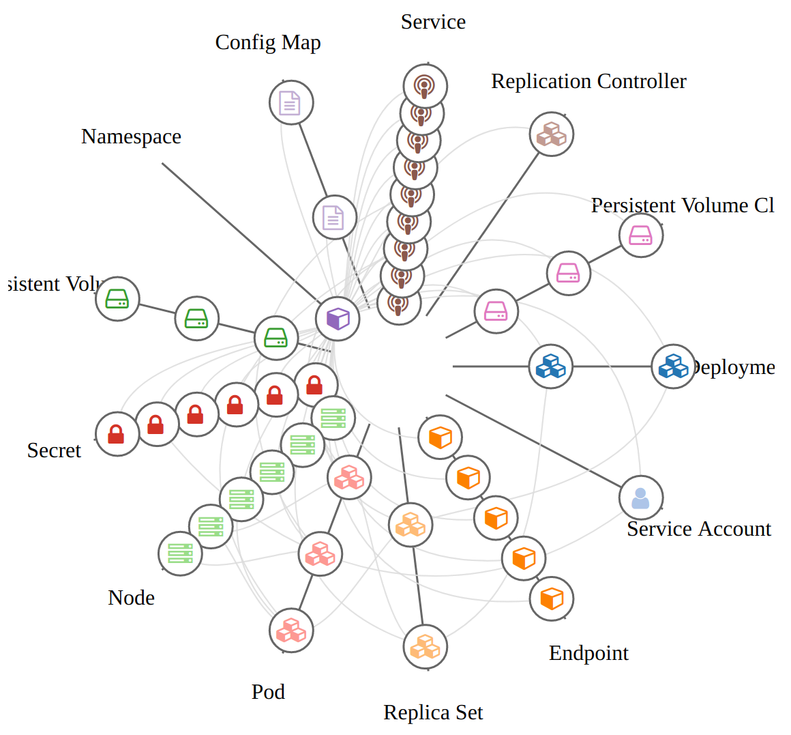
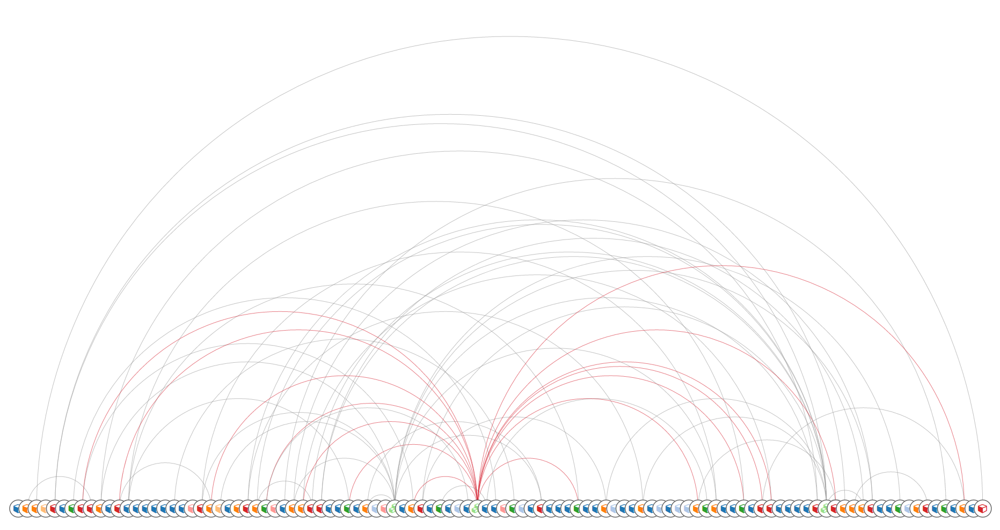
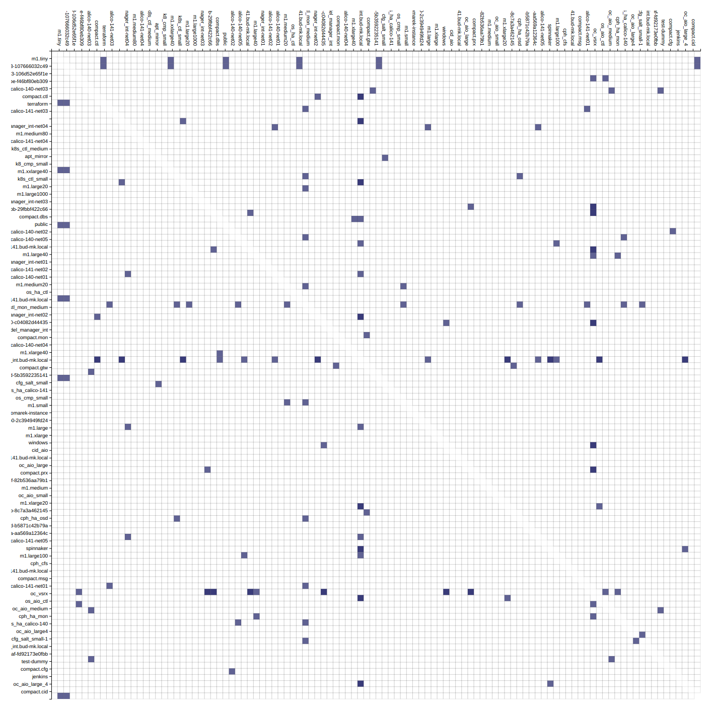
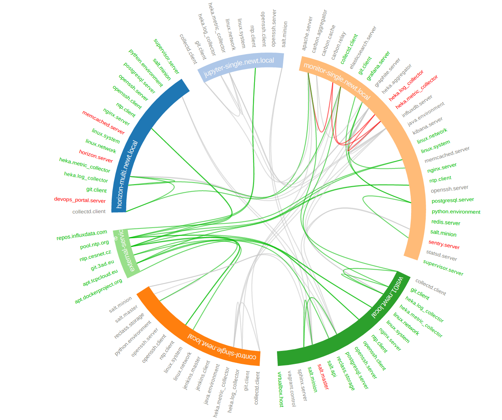

=================
The Architect API
=================

The aim of this project is to provide unified service modeling, management and
visualization platform agnostic of delivery method. It creates virtual
representations of any software services or physical resources and allows
control over thier entire life-cycle. The name of project comes Architect program in Matrix movie series:

    In the Matrix the Architect was a highly specialized, humorless program of
    the machine world as well as the creator of the Matrix. As the chief
    administrator of the system, he is possibly a collective manifestation, or
    at the very least a virtual representation of the entire Machine
    mainframe.

The Architect service consists of several main compontents:

Inventory Component
    Inventory is the Architect's metadata engine. It encapsulates and unifies data
    from various metadata sources to provide inventory/metadata for various
    orchestration services.

Manager Component
    Manager is the Architect's orchestration engine. The aim of this module is
    to enforce infrastructure topologies models and acquire live
    infrastructure topology data from any resource provider for further
    relational and quantitative analysis and visualisations.

Monitor Component
	The structure of infrastructure resources is directed graph that can be
	subject for further analysis. We can perform several transformation
	functions on this graph data in Monitor component.

Inventory Component
===================

Inventory is the Architect's metadata engine. It encapsulates and unifies data
from various metadata sources to provide inventory/metadata for various
orchestration services. Currently supported metadata engines are:

* reclass (python3 version)

Manager Component
=================

Manager is the Architect's orchestration engine. The aim of this module is to
enforce infrastructure topologies models and acquire live infrastructure
topology data from any resource provider for further relational and
quantitative analysis and visualisations.

The pull approach for querying endpoint APIs is supported at the moment, the
processing push from target services is supported for SaltStack events.
Currently supported resource providers are:

* Kubernetes clusters
* OpenStack clouds
* Amazon web services
* SaltStack infrastructures
* Terraform templates
* Jenkins pipelines

The following resource providers are to be intergrated in near future.

* GCE and Azure clouds
* Cloudify TOSCA blueprints
* JUJU templates

Monitor Component
=================

The structure of infrastructure resources is directed graph that can be
subject for further analysis. We can perform several transformation functions
on this graph data in Monitor component.

Graph Analysis
--------------

You can alter the scraped strusctured in several ways. Either you want to get
the subset of the resources (vertices and edges) or you want to combine
multiple graphs and link the same nodes in each.

Subgraphs - Slicing and Dicing
~~~~~~~~~~~~~~~~~~~~~~~~~~~~~~

To slice and dice is to break a body of information down into smaller parts or
to examine it from different viewpoints that we can understand it better.

In cooking, you can slice a vegetable or other food or you can dice it (which
means to break it down into small cubes). One approach to dicing is to first
slice and then cut the slices up into dices.

In data analysis, the term generally implies a systematic reduction of a body
of data into smaller parts or views that will yield more information. The term
is also used to mean the presentation of information in a variety of different
and useful ways. In our case we find useful subgraphs of the infrastructures.

For example in OpenStack infrastructure we can show the ``aggregate zone`` -
``hypervisor`` - ``instance`` relations and show the quantitative properties
of hypervisors and instances. The properties can be used RAM or CPU, runtime -
the age of resources or any other property of value.

Another example would be filtering of resources by tenant or stack
attributions. This reduces the number of nodes to the reasonable amount.

Inter-graphs
~~~~~~~~~~~~

On other hand you want to combine several graphs to create one overlaying
graph. This is very useful to combine in other ways undelated resources. For
example we can say that ``OpenStack Server`` or ``AWS Instance`` and ``Salt
Minion`` are really the same resources.

Data Corellations
-----------------

With the relational information we are now able to corellate resources and
joined topologies from varius information sources. This gives you the real
power, while having the underlying relational structure, you can gather
unstructured metrics, events, alarms and put them into proper context in you
managed resources.

Metrics Corellations
~~~~~~~~~~~~~~~~~~~~

The metrics collected from you infrastrucute can be assigned to various
vertices and edges in your network. This can give you more insight to the
utilisation of depicted infrastructures.

You can have the following query to the prometheus server that gives you the
rate of error response codes goint through a HAproxy for example.

.. code-block:: yaml

    sum(irate(haproxy_http_response_5xx{
        proxy=~"glance.*",
        sv="FRONTEND"
    }[5m]))

Or you can have the query with the same result to the InfluxDB server:

.. code-block:: yaml

    SELECT sum("count")
        FROM "openstack_glance_http_response_times"
        WHERE "hostname" =~ /$server/
            AND "http_status" = '5xx'
            AND $timeFilter
        GROUP BY time($interval)
    fill(0)

Having these metrics you can assign numerical properties of your relational
nodes with these values and use them in correct context.

Events Corellations
~~~~~~~~~~~~~~~~~~~

As you can query the time-series databases, you are able to query also the
ElasticSearch for events.

.. code-block:: yaml

    "searchSourceJSON": {
        "index": "log-*",
        "query": {
            "query_string": {
                "query": "*",
                "analyze_wildcard": true
            }
        },
        "filter": []
    }

The events are transformed to numerical representation and create again
numerical properies of both nodes and vertices.

Alarm Corellations
~~~~~~~~~~~~~~~~~~

You can corellate the output of the alarm evaluators to dynamically set the
status of resources. You can use the functional status of checks from
Prometheus Alarmmanager, Nagios or Sensu.

Visualization Layouts
---------------------

Different data require different diagram visualization. Diagrams are symbolic
representation of information according to some visualization technique. Every
time you need to emphasise different qualities of displayed resources you can
choose from several layouts to display the data.

Network Graph Layouts
~~~~~~~~~~~~~~~~~~~~~

For most of the cases we will be dealing with network data that do not have
any single root or beginning.

Force-Directed Graph
^^^^^^^^^^^^^^^^^^^^

`Force-directed graph` drawing algorithms are used for drawing graphs in an
aesthetically pleasing way. Their purpose is to position the nodes of a graph
in two-dimensional or three-dimensional space so that all the edges are of
more or less equal length and there are as few crossing edges as possible, by
assigning forces among the set of edges and the set of nodes, based on their
relative positions, and then using these forces either to simulate the motion
of the edges and nodes or to minimize their energy.

.. figure:: ./doc/source/static/img/monitor/force-directed-plot.png
    :width: 600px
    :figclass: align-center

    Force-directed plot of all OpenStack resources (cca 3000 resources)

Hive Plot
^^^^^^^^^

The `hive plot` is a visualization method for drawing networks. Nodes
are mapped to and positioned on radially distributed linear axes — this
mapping is based on network structural properties. Edges are drawn as curved
links. Simple and interpretable.

    Hive plot of all OpenStack resources (cca 3000 resources)

Arc Diagram
^^^^^^^^^^^

An `arc diagram` is a style of graph drawing, in which the vertices of a graph
are placed along a line in the Euclidean plane, with edges being drawn as
semicircles in one of the two halfplanes bounded by the line, or as smooth
curves formed by sequences of semicircles. In some cases, line segments of the
line itself are also allowed as edges, as long as they connect only vertices
that are consecutive along the line.

    Arc diagram of OpenStack project's resources (cca 100 resources)

Adjacency Matrix
^^^^^^^^^^^^^^^^

An adjacency matrix is a square matrix used to represent a finite graph. The
elements of the matrix indicate whether pairs of vertices are adjacent or not
in the graph.

    Adjacency matrix of OpenStack project's resources (cca 100 resources)

Hierarchical Edge Bundling
^^^^^^^^^^^^^^^^^^^^^^^^^^

Danny Holten presents an aesthetically pleasing way of simplifying graphs and
making tree graphs more accessible. What makes his project so useful, however,
is how he outlines the particular thought process that goes into making a
visualization.

    Hierarchical edge bundling of SaltStack services (cca 100 resources)

Tree Graph Layouts
~~~~~~~~~~~~~~~~~~

Directed graph traversal can give os acyclic structures suitable for showing
parent-child relations in your subraphs.

Installation
============

Following steps show how to deploy various components of the Architect service
and connections to external services.

Service architect-api
---------------------

The core service responsible for handling HTTP API requests and providing
simple UI based on Material design. Release version of architect-api is
currently available on `Pypi <https://pypi.org/project/architect-api/>`_, to
install it, simply execute:

.. code-block:: bash

    pip install architect-api

To bootstrap latest development version into local virtualenv, run following
commands:

.. code-block:: bash

    git clone git@github.com:cznewt/architect-api.git
    cd architect-api
    virtualenv venv
    source venv/bin/activate
    python setup.py install

Service architect-client
------------------------

Managers that do not expose any form of API can be controlled locally by using
architect-adapter worker that wrap the local orchestration engine (Ansible,
Cloudify, TerraForm).

Salt Master (Inventory Integration)
~~~~~~~~~~~~~~~~~~~~~~~~~~~~~~~~~~~

To enable Salt Master inventory, you need to install ``http_architect`` Pillar
and Top modules and add following to the Salt Master configuration files.

.. code-block:: yaml

    http_architect: &http_architect
      project: local-salt
      host: architect.service.host
      port: 8181

    ext_pillar:
      - http_architect: *http_architect

    master_tops:
      http_architect: *http_architect

Salt Master (Manager Integration)
~~~~~~~~~~~~~~~~~~~~~~~~~~~~~~~~~

You can control salt master infrasturctue and get the status of managed hosts
and resources. The Salt engine ``architect`` relays the state outpusts of
individual state runs and ``architect`` runners and modules provide the
capabilities to interface with salt and architect functions. The Salt Master
is managed through it's HTTP API service.

.. code-block:: yaml

    http_architect: &http_architect
      project: newt.work
      host: 127.0.0.1
      port: 8181

Configuration
=============

You provide one configuration file for all settings fixtures. The default
location is ``/etc/architect-api/config.yaml``.

Endpoints Configuration
-----------------------

Each manager endpoint expects different configuration. Following samples show
the required parameters to setup individual endpoint kinds.

Amazon Web Services
~~~~~~~~~~~~~~~~~~~

AWS manager uses ``boto3`` high level AWS python SDK for accessing and
manipulating with AWS resources.

.. code-block:: yaml

    region: us-west-2
    aws_access_key_id: {{ access_key_id }}
    aws_secret_access_key: {{ secret_access_key }}

Kubernetes
~~~~~~~~~~

Kubernetes requires some information from kubeconfig file. You provide the
parameters of the cluster and the user to the scraper. These can be found
under corresponding keys.

.. code-block:: yaml

    scope: global
    cluster:
      certificate-authority-data: |
        {{ ca-for-server-and-clients }}
      server: https://{{ kubernetes-api }}:443
    user:
      client-certificate-data: |
        {{ client-cert-public }}
      client-key-data: |
        {{ client-cert-private }}

.. note::

    Options ``config.cluster`` and ``config.user`` can be found in your
    ``kubeconfig`` file. Just copy the config fragment with cluster parameters
    and fragment with user parameter.

OpenStack
~~~~~~~~~

Configuration for keystone v2 and keystone v3 clouds. Configuration sample for
single tenant access.

.. code-block:: yaml

    scope: local
    region_name: RegionOne
    compute_api_version: '2.1'
    auth:
      username: {{ user-name }}
      password: {{ user-password }}
      project_name: {{ project-name }}
      domain_name: 'default'
      auth_url: https://{{ keystone-api }}:5000/v3

Config for scraping resources from entire cloud.

.. code-block:: yaml

    scope: global
    region_name: RegionOne
    auth:
      username: {{ admin-name }}
      password: {{ admin-password }}
      project_name: admin
      auth_url: https://{{ keystone-api }}:5000/v2.0

SaltStack
~~~~~~~~~

Configuration for connecting to Salt API.

.. code-block:: yaml

    auth_url: http://{{ salt-api }}:8000
    username: {{ user-name }}
    password: {{ user-password }}

Terraform
~~~~~~~~~

Configuration for parsing terraform templates.

.. code-block:: yaml

    dir: ~/terraform/{{ terraform-dir }}
