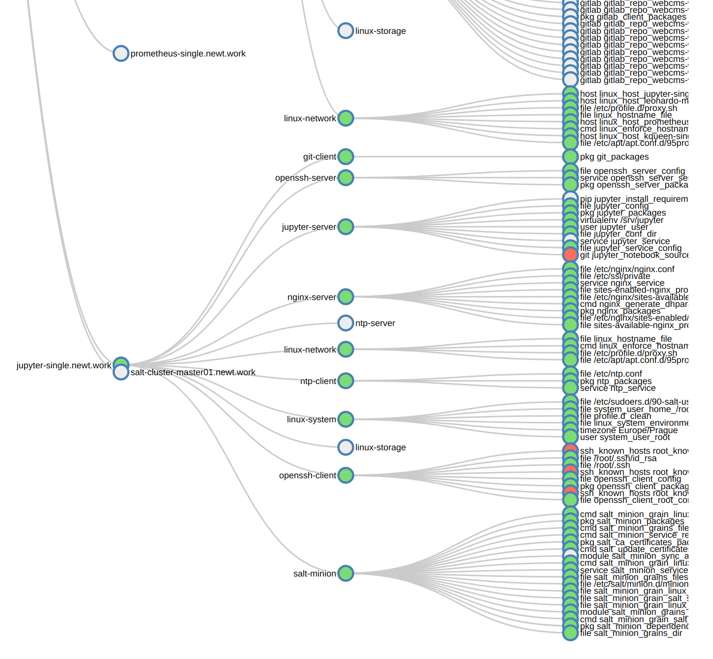
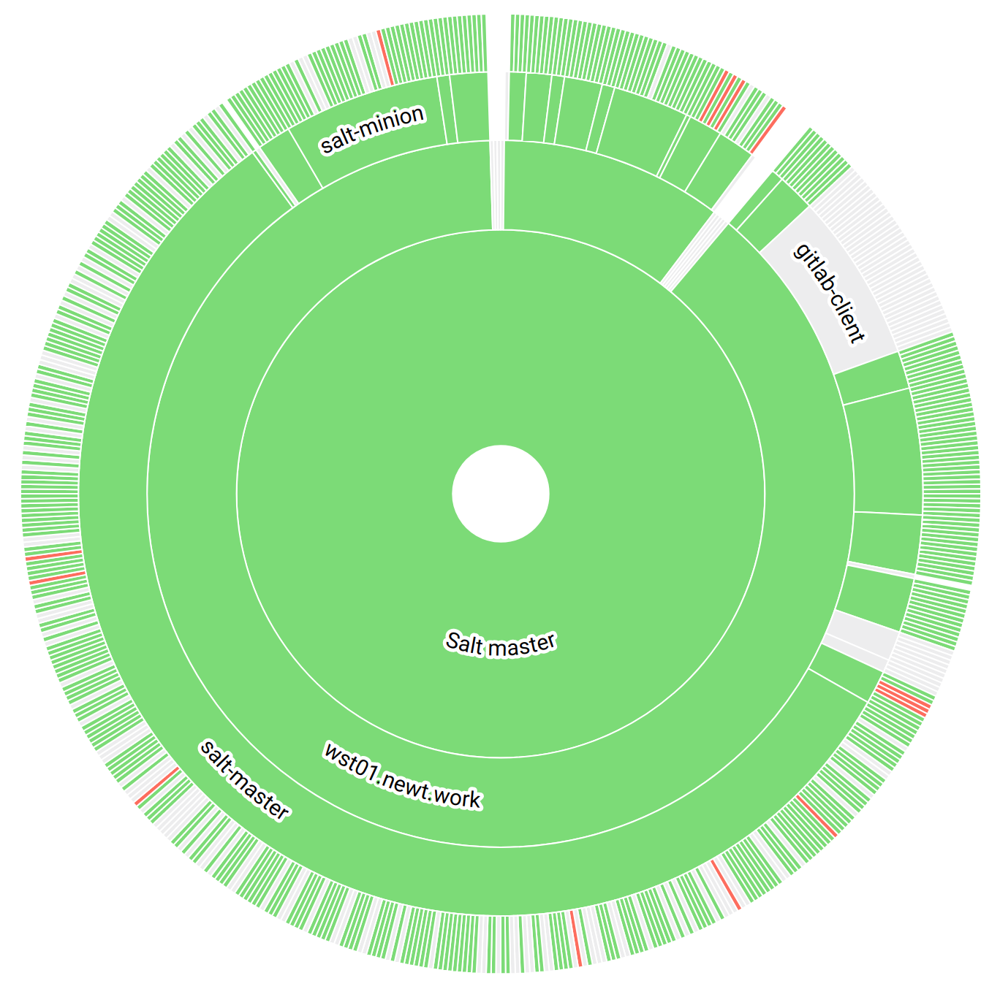
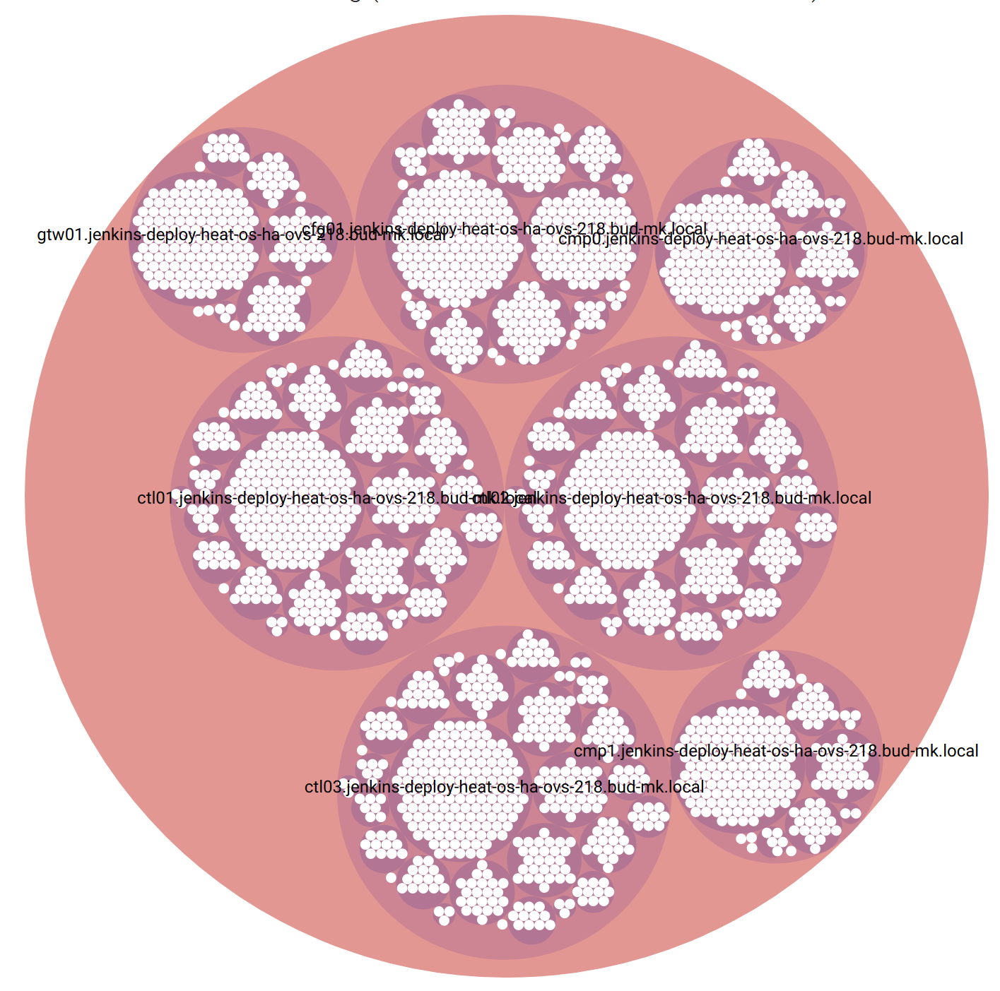

===========================
Hierarchical Visualizations
===========================

Tree graphs are frequently drawn as ``node-link diagrams`` in which the vertices
are represented as disks, boxes, or textual labels and the edges are
represented as line segments, polylines, or curves in the Euclidean plane.

Node-link diagrams can be traced back to the 13th century work of Ramon Llull,
who drew diagrams of this type for complete graphs in order to analyze all
pairwise combinations among sets of metaphysical concepts.

Dendrogram
==========

Dendrograms are node-link diagrams that place leaf nodes of the tree at the
same depth. Dendograms are typically less compact than tidy trees, but are
useful when all the leaves should be at the same level, such as for
hierarchical clustering or phylogenetic tree diagrams.

    SaltStack services in Hierarchical edge bundle

References
----------

* https://bl.ocks.org/mbostock/4063570
* https://en.wikipedia.org/wiki/Dendrogram

Partition Layout
================

The partition layout produces adjacency diagrams: a space-filling variant of a
node-link tree diagram. Rather than drawing a link between parent and child in
the hierarchy, nodes are drawn as solid areas (either arcs or rectangles), and
their placement relative to other nodes reveals their position in the
hierarchy. The size of the nodes encodes a quantitative dimension that would
be difficult to show in a node-link diagram.

    SaltStack services in Sunburst Diagram

References
----------

* https://bl.ocks.org/mbostock/4063423

Circle Packing
==============

We display resources as circles with lower-level resources as inner circles.
Circle packing in a circle is a two-dimensional packing problem with the
objective of packing unit circles into the smallest possible larger circle.

    SaltStack services in Circle Packing

References
----------

* https://en.wikipedia.org/wiki/Circle_packing_in_a_circle
* https://bl.ocks.org/mbostock/7607535

Treemap
=======

Treemaps display hierarchical (tree-structured) data as a set of nested
rectangles. Each branch of the tree is given a rectangle, which is then tiled
with smaller rectangles representing sub-branches. A leaf node's rectangle has
an area proportional to a specified dimension of the data. Often the leaf
nodes are colored to show a separate dimension of the data.

When the color and size dimensions are correlated in some way with the tree
structure, one can often easily see patterns that would be difficult to spot
in other ways, such as if a certain color is particularly relevant. A second
advantage of treemaps is that, by construction, they make efficient use of
space. As a result, they can legibly display thousands of items on the screen
simultaneously.

References
----------

* https://bl.ocks.org/shimizu/6d60e554dcbba406721e73ed5afdf713
* https://en.wikipedia.org/wiki/Treemapping
