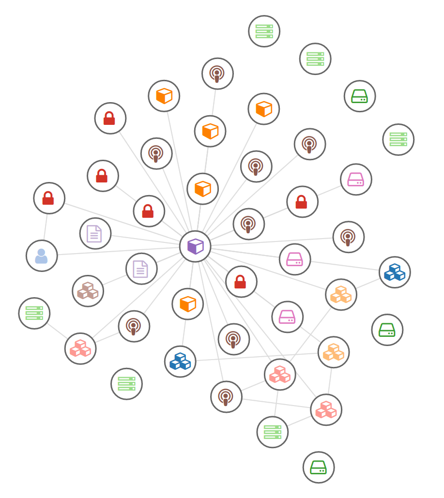
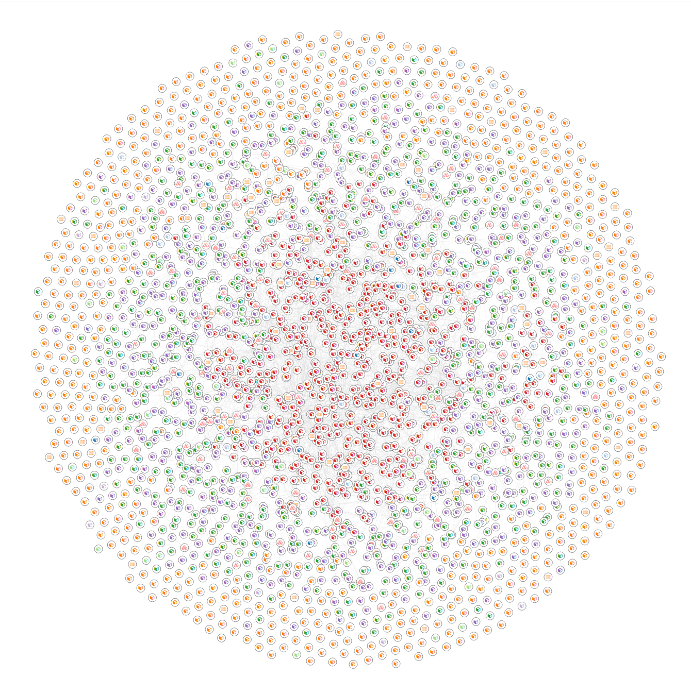
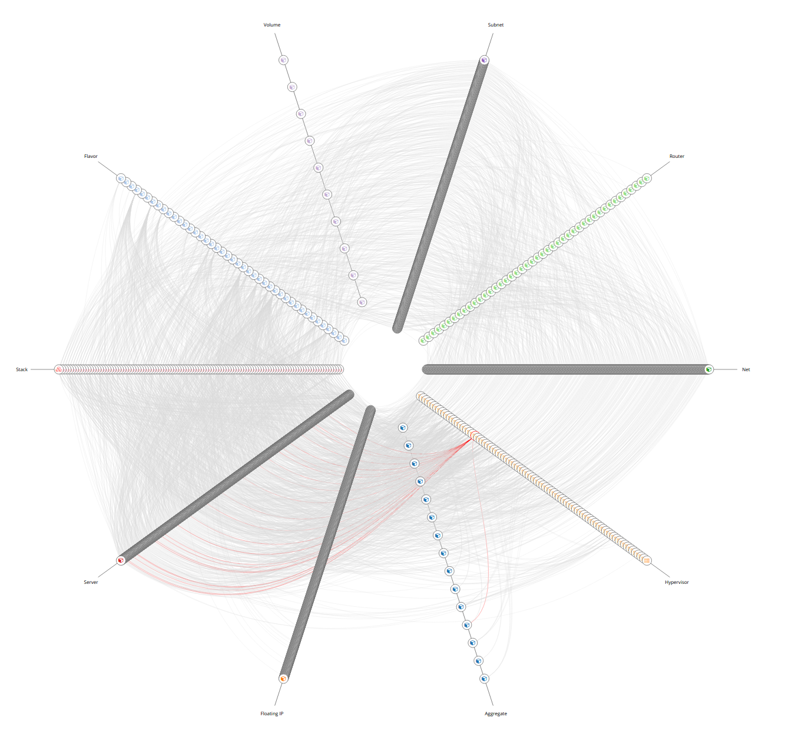

============================
Network Graph Visualizations
============================

Graph drawing or network diagram is a pictorial representation of the vertices
and edges of a graph. This drawing should not be confused with the graph
itself, very different layouts can correspond to the same graph. In the
abstract, all that matters is which pairs of vertices are connected by edges.
In the concrete, however, the arrangement of these vertices and edges within a
drawing affects its understandability, usability, fabrication cost, and
aesthetics.

The problem gets worse, if the graph changes over time by adding and deleting
edges (dynamic graph drawing) and the goal is to preserve the user's mental
map.

Arc Diagram
===========

An *arc diagram* is a style of graph drawing, in which the vertices of a graph
are placed along a line in the Euclidean plane, with edges being drawn as
semicircles in one of the two halfplanes bounded by the line, or as smooth
curves formed by sequences of semicircles. In some cases, line segments of the
line itself are also allowed as edges, as long as they connect only vertices
that are consecutive along the line.

The use of the phrase *arc diagram* for this kind of drawings follows the use
of a similar type of diagram by Wattenberg (2002) to visualize the repetition
patterns in strings, by using arcs to connect pairs of equal substrings.
However, this style of graph drawing is much older than its name, dating back
to the work of Saaty (1964) and Nicholson (1968), who used arc diagrams to
study crossing numbers of graphs. An older but less frequently used name for
arc diagrams is `linear embeddings`.

.. figure:: ../static/img/monitor/arc-diagram.png
    :width: 60%
    :figclass: align-center

    OpenStack project resources in Arc diagram (cca 100 resources)

Heer, Bostock & Ogievetsky wrote that arc diagrams "may not convey the overall
structure of the graph as effectively as a two-dimensional layout", but that
their layout makes it easy to display multivariate data associated with the
vertices of the graph.

References
----------

* https://en.wikipedia.org/wiki/Arc_diagram
* https://bl.ocks.org/rpgove/53bb49d6ed762139f33bdaea1f3a9e1c Arc diagram
* http://bl.ocks.org/sjengle/5431779 D3 Arc Diagram

Force-Directed Graph
====================

A *Force-directed graph* drawing algorithms are used for drawing graphs in an
aesthetically pleasing way. Their purpose is to position the nodes of a graph
in two-dimensional or three-dimensional space so that all the edges are of
more or less equal length and there are as few crossing edges as possible, by
assigning forces among the set of edges and the set of nodes, based on their
relative positions, and then using these forces either to simulate the motion
of the edges and nodes or to minimize their energy.

    Kubernetes cluster in Force-directed graph

While graph drawing can be a difficult problem, force-directed algorithms,
being physical simulations, usually require no special knowledge about graph
theory such as planarity.

    Whole OpenStack cloud in Force-directed graph (cca 3000 resources)

Good-quality results can be achieved for graphs of medium size (up to 50–500
vertices), the results obtained have usually very good results based on the
following criteria: uniform edge length, uniform vertex distribution and
showing symmetry. This last criterion is among the most important ones and is
hard to achieve with any other type of algorithm.

References
----------

* https://en.wikipedia.org/wiki/Force-directed_graph_drawing
* https://bl.ocks.org/shimizu/e6209de87cdddde38dadbb746feaf3a3 shimizu’s D3 v4 - force layout
* https://bl.ocks.org/mbostock/3750558 Mike Bostock’s Sticky Force Layout
* https://bl.ocks.org/emeeks/302096884d5fbc1817062492605b50dd D3v4 Constraint-Based Layout
* http://bl.ocks.org/biovisualize/5801758 dag layout
* http://bl.ocks.org/bobbydavid/5841683 DAG visualization
* https://bl.ocks.org/emeeks/302096884d5fbc1817062492605b50dd D3v4 Constraint-Based Layout
* https://bl.ocks.org/denisemauldin/cdd667cbaf7b45d600a634c8ae32fae5 Filtering Nodes on Force-Directed Graphs (D3 V4)

Hierarchical Edge Bundling
==========================

A *hierarchical edge bundling* is a new method for visualizing such compound
graphs. Our approach is based on visually bundling the adjacency edges, i.e.,
non-hierarchical edges, together. We realize this as follows. We assume that
the hierarchy is shown via a standard tree visualization method. Next, we bend
each adjacency edge, modeled as a B-spline curve, toward the polyline defined
by the path via the inclusion edges from one node to another.

.. figure:: ../static/img/monitor/hiearchical-edge-bundling.png
    :width: 60%
    :figclass: align-center

    Hierarchical edge bundling of SaltStack services and their relations (cca 100 nodes)

This hierarchical bundling reduces visual clutter and also visualizes implicit
adjacency edges between parent nodes that are the result of explicit adjacency
edges between their respective child nodes. Furthermore, hierarchical edge
bundling is a generic method which can be used in conjunction with existing
tree visualization techniques.

References
----------

* http://www.win.tue.nl/vis1/home/dholten/papers/bundles_infovis.pdf
* https://www.win.tue.nl/vis1/home/dholten/papers/forcebundles_eurovis.pdf
* https://bl.ocks.org/mbostock/7607999 Hierarchical Edge Bundling

Hive Plot
=========

The *hive plot* is a visualization method for drawing networks. Nodes are
mapped to and positioned on radially distributed linear axes — this mapping is
based on network structural properties. Edges are drawn as curved links.
Simple and interpretable.

.. figure:: ../static/img/monitor/hive-plot.png
    :width: 50%
    :figclass: align-center

    Kubernetes cluster in Hive plot

The purpose of the hive plot is to establish a new baseline for visualization
of large networks — a method that is both general and tunable and useful as a
starting point in visually exploring network structure.

    Whole OpenStack cloud in Hive plot (cca 10 000 resources)

References
----------

* http://mkweb.bcgsc.ca/linnet/
* https://bost.ocks.org/mike/hive/

Adjacency Matrix
================

An *adjacency matrix* is a square matrix used to represent a finite graph. The
elements of the matrix indicate whether pairs of vertices are adjacent or not
in the graph.

In the special case of a finite simple graph, the adjacency matrix is a
(0,1)-matrix with zeros on its diagonal. If the graph is undirected, the
adjacency matrix is symmetric. The relationship between a graph and the
eigenvalues and eigenvectors of its adjacency matrix is studied in spectral
graph theory.

.. figure:: ../static/img/monitor/adjacency-matrix.png
    :width: 60%
    :figclass: align-center

    Adjacency matrix of OpenStack project's resources (cca 100 nodes)

The adjacency matrix should be distinguished from the incidence matrix for a
graph, a different matrix representation whose elements indicate whether
vertex–edge pairs are incident or not, and degree matrix which contains
information about the degree of each vertex.

References
----------

* https://en.wikipedia.org/wiki/Adjacency_matrix
* https://github.com/micahstubbs/d3-adjacency-matrix-layout
* https://bl.ocks.org/micahstubbs/7f360cc66abfa28b400b96bc75b8984e Micah Stubbs’s adjacency matrix layout

Sankey Diagram
==============

*Sankey diagrams* are a specific type of flow diagram, in which the width of
the arrows is shown proportionally to the flow quantity. Sankey diagrams put a
visual emphasis on the major transfers or flows within a system. They are
helpful in locating dominant contributions to an overall flow. Often, Sankey
diagrams show conserved quantities within defined system boundaries.

Sankey diagrams are named after Irish Captain Matthew Henry Phineas Riall
Sankey, who used this type of diagram in 1898 in a classic figure (see panel
on the right) showing the energy efficiency of a steam engine. While the first
charts in black and white were merely used to display one type of flow (e.g.
steam), using colors for different types of flows has added more degrees of
freedom to Sankey diagrams.

One of the most famous Sankey diagrams is Charles Minard's Map of Napoleon's
Russian Campaign of 1812. It is a flow map, overlaying a Sankey diagram onto a
geographical map. It was created in 1869, so it actually predates Sankey's
'first' Sankey diagram of 1898.

References
----------

* https://en.wikipedia.org/wiki/Sankey_diagram
* https://github.com/FabricioRHS/skd3
* https://bl.ocks.org/emeeks/e9d64d27f286e61493c9 Sankey Particles IV

Alluvial Diagram
================

Alluvial diagrams are a type of flow diagram originally developed to represent
changes in network structure over time. In allusion to both their visual
appearance and their emphasis on flow, alluvial diagrams are named after
alluvial fans that are naturally formed by the soil deposited from streaming
water.

References
----------

* https://en.wikipedia.org/wiki/Alluvial_diagram
* http://bl.ocks.org/igorzilla/3086583 Alluvial Diagram
