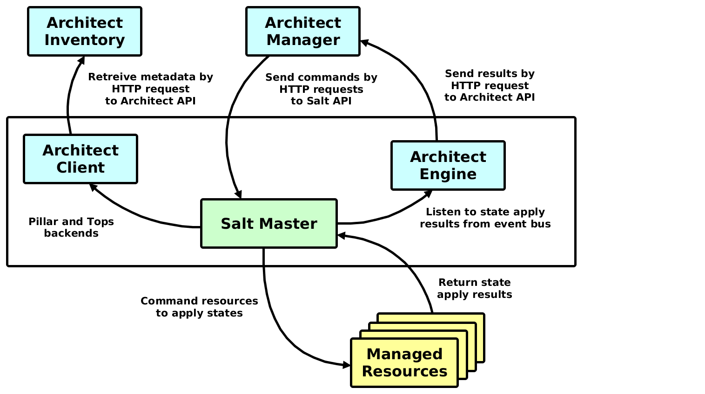

=========================
SaltStack Infrastructures
=========================

Configuration for connecting to Salt API endpoint.

.. literalinclude:: ../static/config/manager-saltstack.yaml
   :language: yaml

Following figure shows how SaltStack integrates with Architect Inventory and
Manager. Please note that you can use Inventory integration independently of
the Manager integration.

